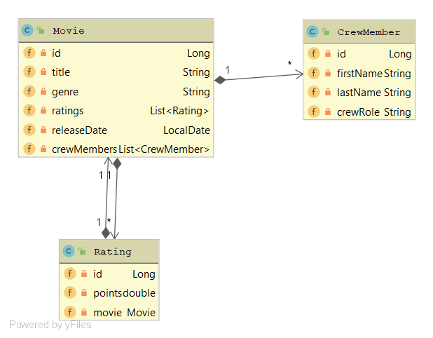

# First Quarkus Example - JPA
The task was to create a small Quarkus application that uses JPA and has some respective REST endpoints. 
I chose a small movie manager which has **movies**, **crew members** and **ratings**.
(crew members instead of actor, director, etc. to ensure the programs extensibility)

I used a postgres database which is running in a docker container.

#### Classdiagram:

